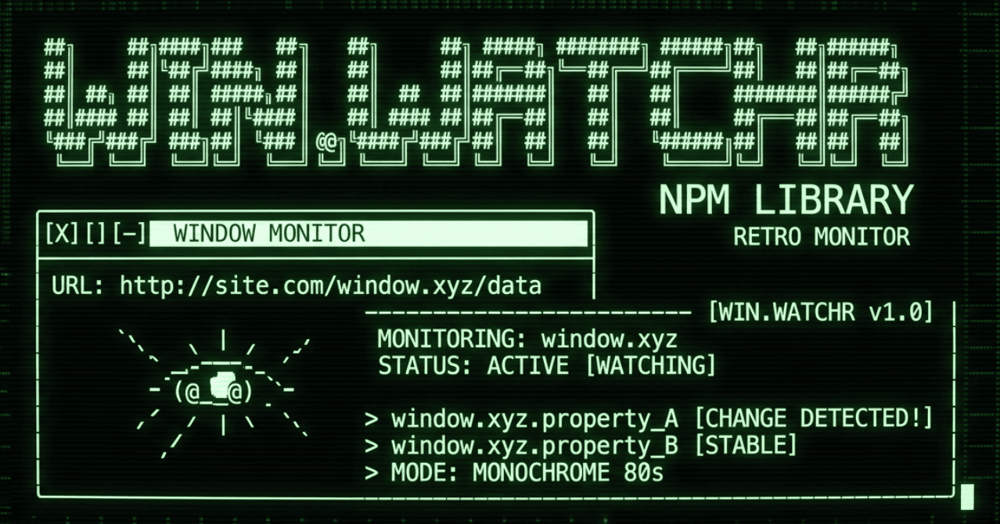

# windotwatchr



[](https://github.com/juanpprieto/windotwatchr/actions/workflows/ci.yml)
[](https://www.npmjs.com/package/windotwatchr)
[](https://bundlephobia.com/package/windotwatchr)
[](https://github.com/juanpprieto/windotwatchr/blob/main/LICENSE)

> Detect `window.*` properties the moment they appear. No polling.

- **~2.4KB gzipped.** React hook adds ~370B.
- **Zero dependencies.** React is an optional peer dep.
- **Proxy-based.** Intercepts property assignment via `Object.defineProperty` traps and ES Proxies. Fires your callback in the same microtask the value is set.
- **Typed.** Written in TypeScript. Generics flow through to your callback or hook result.

```
npm install windotwatchr
```

### AI Agent Skill

Give your AI coding agent deep knowledge of windotwatchr's API, internals, and best practices:

```bash
# Any agent (Claude Code, Cursor, Copilot, 38+ others)
npx skills add juanpprieto/windotwatchr -s windotwatchr-expert

# Claude Code plugin marketplace
/plugin marketplace add juanpprieto/windotwatchr
/plugin install windotwatchr-expert@windotwatchr
```

## Live Demos

- [Next.js showcase](https://juanpprieto.github.io/windotwatchr/nextjs/)
- [Vite + React showcase](https://juanpprieto.github.io/windotwatchr/vite-react/)

## The Problem

Third-party scripts attach themselves to `window` at unpredictable times. Many provide no ready callback, making it hard to coordinate dependent UX flows, defer analytics events until an SDK is initialized, or render widgets that depend on deeply nested APIs. The standard workaround is a `setTimeout` loop:

```js
const check = () => {
  if (window.AfterPay) {
    AfterPay.initialize({ countryCode: 'US' });
  } else {
    setTimeout(check, 100); // poll until it exists
  }
};
check();
```

This is wasteful, timing-dependent, and gets worse with deeply nested paths like `window.acmePayments.ui.components`.

<details>
<summary>Ecommerce examples</summary>

| SDK | Window global | Has ready callback? | Notes |
|-----|---------------|---------------------|-------|
| Afterpay/Clearpay | `window.AfterPay` | No | Relies on `script.onload`. No event or promise. |
| Affirm | `window.affirm` | Partial | `affirm.ui.ready(fn)` exists but requires the stub to already be on `window`. Race condition on SPAs. |
| Attentive | `window.__attentive` | No | Docs recommend `setTimeout(() => __attentive.trigger(), 500)`. |
| Yotpo | `window.yotpo` | Unreliable | `yotpo.onAllWidgetsReady(fn)` throws if called before bootstrap. Devs resort to polling or `MutationObserver`. |
| Klaviyo | `window.klaviyo` | Partial | Proxy-based queue buffers method calls, but no "ready" event for detecting initialization. |
| Klarna | `window.Klarna` | Yes | `window.klarnaAsyncCallback` fires on load. |
| Gorgias | `window.GorgiasChat` | Yes | `gorgias-widget-loaded` event + `GorgiasChat.init()` returns a Promise. |

</details>

The same problem applies beyond ecommerce: analytics coordination (firing events only after a tracker is fully initialized), A/B testing tools that gate rendering on experiment configs, and any script that builds its API surface incrementally across multiple async stages.

## Usage

### Callback

```ts
import { watchWindot } from 'windotwatchr';

const dispose = watchWindot<typeof AfterPay>('AfterPay', (ap) => {
  ap.initialize({ countryCode: 'US' });
});

// Stop watching:
dispose();
```

### Promise

```ts
import { waitForWindot } from 'windotwatchr';

const ap = await waitForWindot<typeof AfterPay>('AfterPay', {
  timeout: 10_000,
});
```

### React Hook

```tsx
import { useWatchWindot } from 'windotwatchr/react';

function Checkout() {
  const { value: afterPay, status, error } = useWatchWindot<typeof AfterPay>('AfterPay');

  if (status === 'error')   return <p>Error: {error?.message}</p>;
  if (status === 'timeout') return <p>AfterPay took too long.</p>;
  if (!afterPay)             return <p>Loading...</p>;

  return <button onClick={() => afterPay.initialize({ countryCode: 'US' })}>Pay later</button>;
}
```

### Nested Paths

Dot-notation works for arbitrarily deep properties. The engine installs Proxy traps at each level and resolves the moment the leaf value is assigned:

```ts
watchWindot('acmePayments.ui.components', (components) => {
  // Fires when window.acmePayments.ui.components is set,
  // even if acmePayments, ui, and components are assigned
  // at different times.
});
```

### Custom Readiness

By default, a value is "ready" when it is not `null` or `undefined`. Override this when an SDK creates a stub object before it is fully initialized:

```ts
watchWindot('acmePx.loaded', (loaded) => {
  console.log('Pixel SDK ready');
}, {
  ready: (value) => value === true,
});
```

### Abort

```ts
const controller = new AbortController();

waitForWindot('AfterPay', { signal: controller.signal })
  .catch((err) => console.log(err.message)); // "windotwatchr: aborted"

controller.abort();
```

## API

### `watchWindot<T>(path, callback, options?): DisposeFunction`

Watches a `window` property path. Calls `callback` with the resolved value when the readiness predicate passes. Returns a function that stops watching.

### `waitForWindot<T>(path, options?): Promise<T>`

Promise wrapper around `watchWindot`. Resolves when the value is ready, rejects on timeout or abort.

### `useWatchWindot<T>(path, options?): WatchWindotResult<T>`

React hook. Returns `{ value, status, error }`. Status transitions: `watching` &rarr; `ready` | `timeout` | `error`. Cleans up on unmount. StrictMode-safe.

Import from `windotwatchr/react`. React 16.8+ required.

### Options

| Option | Type | Default | Description |
|--------|------|---------|-------------|
| `timeout` | `number` | none | Time in ms before a `ww:timeout` event fires. |
| `pollInterval` | `number` | `100` | Polling interval in ms for frozen/sealed objects. `0` disables. |
| `strategy` | `'proxy' \| 'poll' \| 'auto'` | `'auto'` | Detection strategy. `auto` uses Proxy when possible, falls back to polling for frozen objects. |
| `ready` | `(value: unknown) => boolean` | `v != null` | Predicate that determines when a value is considered ready. |
| `retries` | `number` | `0` | Retry attempts after timeout before giving up. |
| `signal` | `AbortSignal` | none | Abort signal to cancel the watcher. |

### Types

```ts
// Result shape from useWatchWindot
interface WatchWindotResult<T> {
  value: T | null;
  status: WatcherState;
  error: Error | null;
}

type WatcherState = 'idle' | 'watching' | 'ready' | 'timeout' | 'error';
type DisposeFunction = () => void;
type SubscriberCallback<T> = (value: T) => void;
```

### Events

The engine dispatches `CustomEvent`s on `window` for lifecycle transitions:

| Event | Detail | When |
|-------|--------|------|
| `ww:ready` | `{ path }` | Value passed the readiness predicate |
| `ww:timeout` | `{ path }` | Timeout elapsed without resolution |
| `ww:error` | `{ path, error }` | Watcher encountered an error |

## How It Works

1. `watchWindot('a.b.c', cb)` installs an `Object.defineProperty` trap on `window.a`.
2. When `window.a` is assigned an object, the engine wraps it in a Proxy and watches for `b`.
3. When `b` is assigned, another Proxy watches for `c`.
4. When `c` is assigned and passes the readiness predicate, `cb` fires in the same microtask.

Multiple watchers on the same root key share a single trap (ref-counted). Cleanup is automatic when all subscribers dispose.

For frozen or sealed objects where Proxy cannot intercept assignments, the engine falls back to polling at `pollInterval`.

## SSR

Both the core API and the React hook are SSR-safe. In non-browser environments:

- `watchWindot` returns a no-op dispose function immediately.
- `waitForWindot` rejects with an `Error`.
- `useWatchWindot` stays in `watching` status (no-op until hydration).

## Examples

See [`examples/nextjs`](examples/nextjs) and [`examples/vite-react`](examples/vite-react) for working demos that detect four mock SDKs with different loading patterns.

## License

MIT
